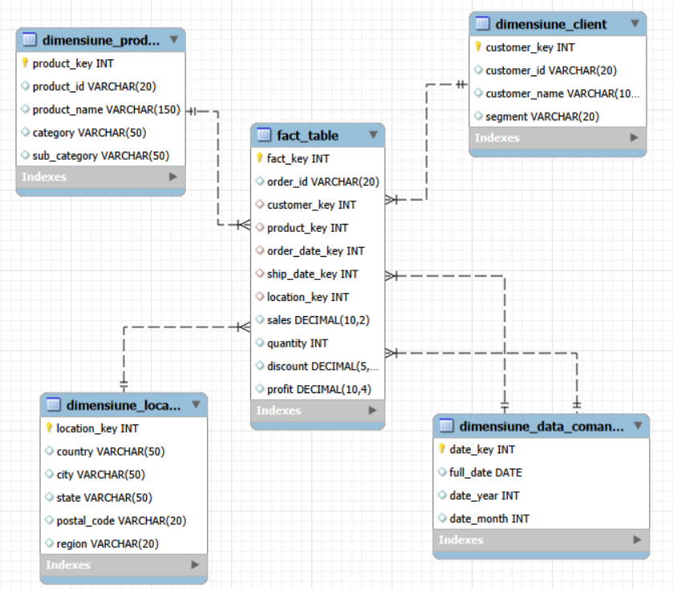
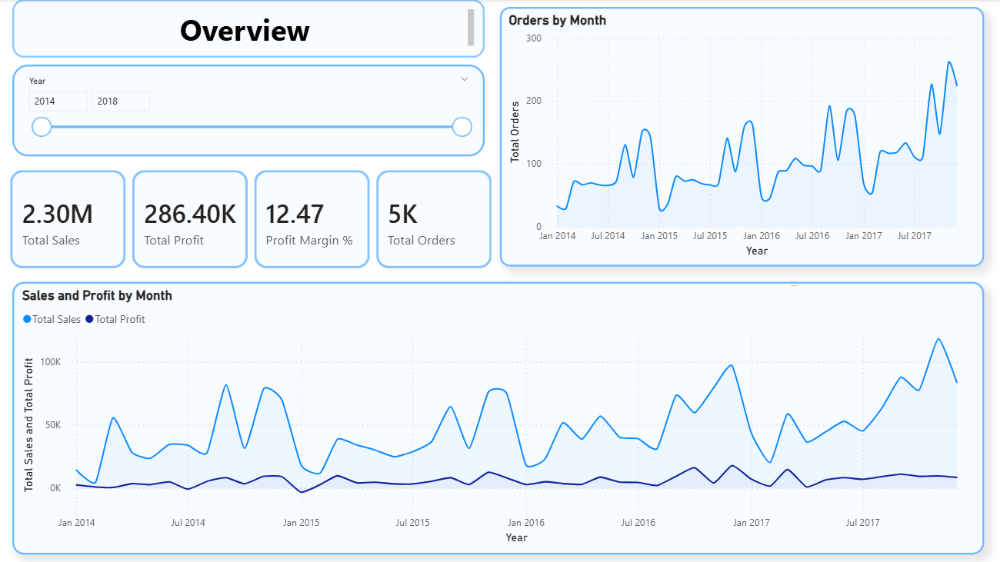
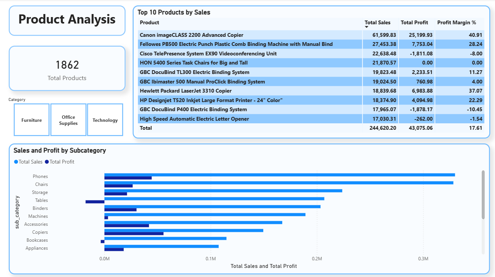
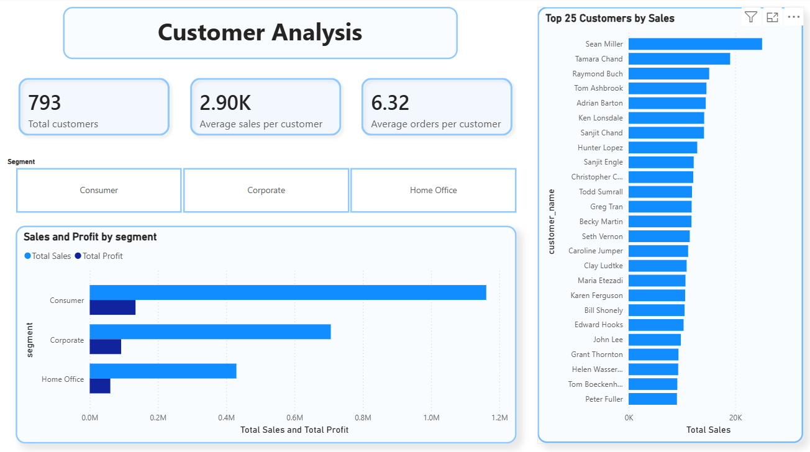
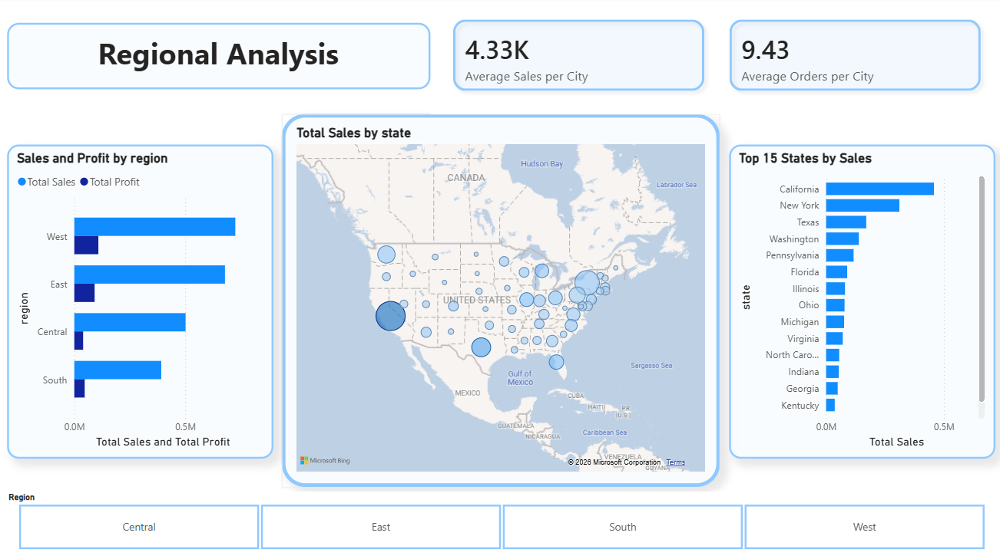

# Sales-Order-Analysis
Sales analysis using MySQL and Power BI. Covers data warehousing, SQL analysis and business intelligence reporting on 9,994 transactions across 4 years.

Author: Sebastian Gheorghita  
Tools: Excel, MySQL, Power BI  
Dataset: Sales Order Dataset (Kaggle) — 9,994 rows, 21 columns

**Dataset source: https://www.kaggle.com/datasets/datawitharyan/sales-order-dataset

  Project Overview

This project analyzes retail sales data from a US-based superstore covering the period 2014–2017. The goal was to design a proper data warehouse using a star schema in MySQL, perform exploratory analysis with SQL, and build an interactive Power BI dashboard to communicate business insights visually.

The project covers the full analyst workflow: data modeling, data transformation, SQL analysis, and business intelligence reporting.

  Data Preparation 

The raw CSV was imported into MySQL using the Table Data Import Wizard. Column data types were adjusted prior to import to match the target table schema (e.g. date fields formatted as YYYY-MM-DD, decimal precision aligned to sales and profit columns).

  Data Model

The raw dataset was transformed into a star schema consisting of one fact table and four dimension tables.

Dimension Tables:

- Client dimension - customer key, customer ID, customer name, segment;
- Product dimension - product key, product ID, product name, category, sub-category;
- Location dimension - location key, country, city, state, postal code, region;
- Date dimension - date key, full date, year, month.

Fact Table:

- fact_table – fact key, order ID, customer key, product key, order date key, ship date key, location key, sales, quantity, discount, profit

  SQL Analysis

All analysis was performed by querying the star schema, joining the fact table to the relevant dimensions.

Key queries:

- Discount impact on average profit:

Discount range	 Orders  	Profit average Total sales
No discount     	 4798	            66.9	1087908.47
1-20%	             3803	            26.5   846522.17
20-40%	            460	          -77.86	 234138.04
40-60%	            215	         -134.62  	71048.31
60%+	              718	          -98.35  	57584.08

  *Any discount above 20% results in negative average profit, making aggressive discounting one of the biggest profit leaks in the business.

- States selling at a loss:

State	       Total sales	Total profit
Texas	         170187.98	-25729.3563
Ohio	          78258.21	-16971.3766
Pennsylvania	 116512.02	-15559.9603
Illinois	      80166.16	-12607.887
North Carolina	55603.09	-7490.9122
Colorado	      32108.12	-6527.8579
Tennessee	      30661.92	-5341.6936
Arizona	        35282.02	-3427.9246
Florida       	89473.73	-3399.3017
Oregon	        17431.14	-1190.4705

  *Despite generating combined revenue of nearly $700K, states like Texas (-$25.7K), Ohio (-$16.9K) and Pennsylvania (-$15.5K) are all unprofitable.

- Which month is historically the best and worst for sales:

Month	Average sales
11	  88115.27
12	  81323.39
9	    76912.49
3	    51251.38
10	  50080.76
8	    39761.00
5	    38757.21
6	    38179.68
7	    36809.53
4	    34440.54
1	    23731.22
2	    14937.82

  *November and December drive peak revenue, averaging $88K and $81K respectively, while January and February are consistently the weakest months at $23.7K and $14.9K.

Other queries included:

- Monthly and yearly sales trends;
- Sales and profit by category and sub-category;
- Top 5 products by profit;
- Products selling at a loss;
- Top 10 customers by revenue;
- Sales and profit by customer segment;
- Sales and profit by region;
- Top 10 cities by sales.

  Power BI Dashboard

The dashboard consists of 4 interactive pages, all connected via slicers for year, category, segment, and region.

Page 1 - Overview

High level KPIs and trends across the full dataset.

- Total Sales: $2.30M;
- Total Profit: $286.40K;
- Profit Margin: 12.47%;
- Total Orders: 5K;
- Sales and profit trend by month showing consistent year-over-year growth;
- A recurring seasonal dip is visible every January–February across all years.

 

Page 2 - Product Analysis

Breakdown of performance by category, sub-category, and individual products.

- Phones are the highest revenue sub-category (~$330K in sales);
- Tables and Bookcases generate significant sales but are unprofitable (-$17K and -$3.5K profit respectively);
- “Canon imageCLASS 2200 Advanced Copier” is the single most profitable product ($25,199 profit);
- Labels have the highest profit margin at 44.4% despite being one of the lowest revenue sub-categories.

 

Page 3 - Customer Analysis

Breakdown of the 793 customers by segment and individual performance.

- Consumer segment dominates with 2,586 orders and $1.16M in sales;
- Sean Miller is the top customer by sales revenue;
- Average of 6.32 orders per customer indicates solid repeat purchase behavior;
- All three segments (Consumer, Corporate, Home Office) show similar profit-to-sales ratios.

Page 4 - Regional Analysis

Geographic breakdown of sales performance across the US.

- West region leads in both sales ($725K) and profit ($108K)
- South region has the lowest sales ($391K) and the lowest profit ($46.7K)
- California, New York, and Texas are the top three states by sales
- Central region shows a disproportionately low profit relative to its sales volume, suggesting discount or cost issues

 
  Business Insights

1. Discounts above 20% destroy profit - the data shows average profit turns negative beyond this threshold. The business should review its discounting policy.
2. Tables and Bookcases are loss-making - despite generating hundreds of thousands in revenue, both sub-categories lose money and should be reviewed for pricing or cost issues.
3. The West region is the most valuable market - highest sales and highest profit, making it the core revenue driver.
4. Seasonal dip every January–February - consistent across all four years, suggesting an opportunity for targeted promotions at the start of the year.
5. Year-over-year growth is strong - sales grew from $424K in 2014 to $733K in 2017, nearly doubling over the period.
6. 10 states are operating at a loss - this affects roughly 20% of all states in the dataset and strongly suggests regional discounting or pricing issues that need addressing.
